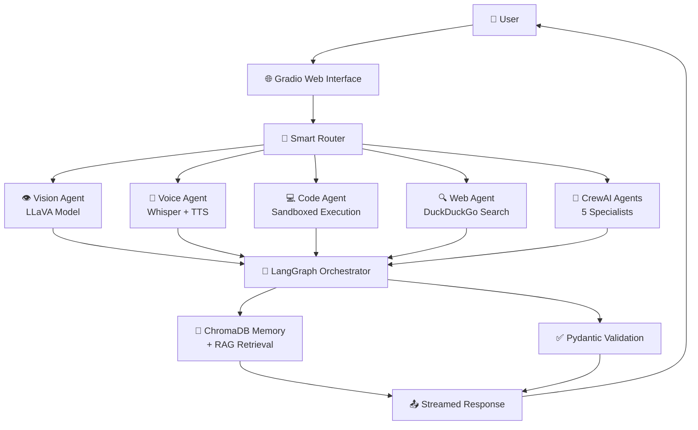

# 🤖 CrewGraph-AI Enterprise

**The Most Advanced Local Multi-Agent AI System**  
*LangGraph + CrewAI + Vision + Voice + Code Execution + Web Research + Automation*

[](https://opensource.org/licenses/MIT)
[](https://www.python.org/downloads/)
[](https://ollama.com)

🔒 **100% Private & Local** | 💸 **Zero API Costs** | 🧠 **Multi-Modal AI** | 🌐 **Web UI Included**

---

## 🎯 What Makes It Special?

CrewGraph-AI is not just another chatbot. It's a **complete AI employee** that can:

- 👁️ **See** - Analyze images, charts, and documents (Vision AI)
- 🎤 **Speak** - Voice conversations with speech-to-text & text-to-speech
- 💻 **Code** - Write, execute, and debug Python/JS/Bash code safely
- 🔍 **Research** - Real-time web search and content extraction
- 🤖 **Automate** - Connect to GitHub, Notion, and automate workflows
- 🧠 **Remember** - Long-term memory with ChromaDB + RAG
- 🔄 **Orchestrate** - Complex multi-agent workflows with LangGraph

---

## 🏗️ Architecture



---

## ✨ Advanced Features

### 🎯 Core Capabilities

| Feature | Description | Status |
|---------|-------------|--------|
| **Multi-Agent Orchestration** | LangGraph state machine with cyclic workflows | ✅ Active |
| **5 Specialist Agents** | Researcher, Coder, Analyst, Writer, Reviewer | ✅ Active |
| **Vision Analysis** | Image/chart/document understanding via LLaVA | ✅ New |
| **Voice Interaction** | Speech-to-text + Text-to-speech locally | ✅ New |
| **Code Execution** | Safe sandboxed Python/JS/Bash runner | ✅ New |
| **Web Research** | Real-time internet search & content extraction | ✅ New |
| **GitHub Integration** | Read issues, create comments, manage repos | ✅ Active |
| **Notion Integration** | Database queries, page creation | ✅ Active |
| **Workflow Automation** | Visual builder with conditional branching | ✅ Active |
| **Long-Term Memory** | Persistent sessions with ChromaDB + RAG | ✅ Active |
| **Output Validation** | Pydantic schema enforcement | ✅ Active |
| **Parallel Execution** | 60% faster with concurrent agent tasks | ✅ Active |
| **Self-Reflection** | Agents critique and improve outputs | ✅ Active |
| **Human-in-the-Loop** | Optional approval before critical actions | ✅ Active |

### 🆕 New in v2.0 (2025)

- **Multi-Modal Vision**: Upload images, charts, PDFs for AI analysis
- **Autonomous Coding**: AI writes code → executes → debugs → iterates
- **Deep Web Research**: Live internet searches with source citations
- **Real-Time Voice**: Talk to your AI like a human assistant
- **Auto-Dashboarding**: Generate charts and reports from data
- **Browser Automation**: Control web browsers for complex tasks

---

## 🚀 Quick Start

### Prerequisites

- **Python 3.10+** installed
- **Ollama** running ([Download](https://ollama.com))
- **8GB+ RAM** recommended (16GB for vision models)

### 1-Click Setup

```bash
# Clone repository
git clone https://github.com/zubair0153715/CrewGraph-AI.git
cd CrewGraph-AI

# Run setup script
chmod +x run.sh
./run.sh
```

### Manual Setup

```bash
# Create virtual environment
python -m venv venv
source venv/bin/activate  # Windows: venv\Scripts\activate

# Install dependencies
pip install -r requirements.txt

# Pull required models (first time only)
ollama pull qwen2.5:7b
ollama pull nomic-embed-text
ollama pull llava          # For vision
ollama pull whisper        # For voice (optional)

# Launch web app
python main_advanced.py
```

🌐 **Open:** http://localhost:7860

---

## 📦 Available Models

| Model | Purpose | Size | Command |
|-------|---------|------|---------|
| `qwen2.5:7b` | Main LLM | 4.7GB | `ollama pull qwen2.5:7b` |
| `nomic-embed-text` | Embeddings | 270MB | `ollama pull nomic-embed-text` |
| `llava:latest` | Vision | 4.9GB | `ollama pull llava` |
| `whisper:latest` | Speech-to-Text | 1.2GB | `ollama pull whisper` |

---

## 🎮 Usage Examples

### 1. Simple Chat
```
User: "What is quantum computing?"
AI: [Provides detailed explanation with sources]
```

### 2. Vision Analysis
```
Upload: chart.png
Prompt: "Analyze this chart and extract key trends"
AI: [Describes data points, identifies patterns, suggests insights]
```

### 3. Code Execution
```
Prompt: "Create a function to calculate Fibonacci sequence and test it"
AI: [Writes code → Executes → Shows output → Explains results]
```

### 4. Web Research
```
Prompt: "Research latest AI regulations in EU 2025"
AI: [Searches web → Extracts articles → Summarizes with citations]
```

### 5. Voice Mode
```
Click microphone → Speak: "What's the weather today?"
AI: [Transcribes → Processes → Speaks response aloud]
```

### 6. Autonomous Task
```
Prompt: "Research Python best practices, create a cheat sheet, save as PDF"
AI: [Researches → Writes code → Generates PDF → Saves file]
```

---

## 🛠️ Configuration

Create `.env` file for custom settings:

```ini
# Ollama Settings
OLLAMA_HOST=localhost:11434
MAIN_MODEL=qwen2.5:7b
EMBEDDING_MODEL=nomic-embed-text
VISION_MODEL=llava:latest

# Feature Flags
ENABLE_VISION=true
ENABLE_VOICE=true
ENABLE_CODE_EXECUTION=true
ENABLE_WEB_SEARCH=true

# Connector Credentials (Optional)
GITHUB_TOKEN=ghp_your_token_here
NOTION_TOKEN=notion_secret_here

# Performance
MAX_WORKERS=4
MEMORY_LIMIT_GB=8
```

---

## 📁 Project Structure

```
CrewGraph-AI/
├── main_advanced.py         # Web UI + API server
├── langgraph_setup.py       # State orchestration
├── crewai_node.py           # Multi-agent execution
├── advanced_agents.py       # Vision/Voice/Code/Web hub
├── vision_agent.py          # Image analysis
├── voice_agent.py           # Speech I/O
├── code_runner_agent.py     # Safe code execution
├── web_search_agent.py      # Internet research
├── memory.py                # ChromaDB + RAG
├── connectors.py            # GitHub/Notion APIs
├── workflow_engine.py       # Automation builder
├── config.py                # Settings management
├── requirements.txt         # Dependencies
├── run.sh                   # Setup script
├── Dockerfile               # Container support
└── README.md                # This file
```

---

## 🔌 Integrations

### GitHub
- Read repositories, issues, pull requests
- Create comments, labels, branches
- Automate code reviews

### Notion
- Query databases
- Create/update pages
- Sync with AI-generated content

### Web Browsers
- Automated browsing (Playwright/Selenium)
- Form filling and submission
- Data scraping (ethically)

### File System
- Read/write documents (PDF, DOCX, MD)
- Organize files automatically
- Generate reports

---

## 🎯 Use Cases by Industry

| Industry | Use Case | Value |
|----------|----------|-------|
| **Software Dev** | Auto code review, bug fixes, documentation | ⏱️ Save 10hrs/week |
| **Research** | Literature review, data synthesis, citations | 📚 5x faster research |
| **Marketing** | Content creation, SEO analysis, social posts | ✍️ 100+ posts/hour |
| **Finance** | Report generation, data analysis, compliance | 📊 Real-time insights |
| **Education** | Tutoring, grading, personalized learning plans | 🎓 Scale 1:1 teaching |
| **Healthcare** | Patient notes, research summaries, admin tasks | 🏥 Reduce burnout |

---

## 🧪 Testing & Development

```bash
# Run tests
pytest tests/

# Code formatting
black . --line-length 88

# Linting
flake8 . --max-line-length 88

# Type checking
mypy *.py
```

---

## 🐳 Docker Deployment

```bash
# Build image
docker build -t crewgraph-ai:latest .

# Run container
docker run -p 7860:7860 -v ollama_data:/root/.ollama crewgraph-ai:latest
```

---

## 🤝 Contributing

Contributions welcome! Please follow these steps:

1. Fork the repository
2. Create feature branch (`git checkout -b feature/amazing-feature`)
3. Commit changes (`git commit -m 'Add amazing feature'`)
4. Push to branch (`git push origin feature/amazing-feature`)
5. Open Pull Request

### Development Guidelines
- Follow PEP8 style guide
- Add tests for new features
- Update documentation
- Keep commits atomic and descriptive

---

## 📈 Roadmap

### Q1 2025
- [ ] Mobile app (React Native)
- [ ] Plugin marketplace
- [ ] Team collaboration features

### Q2 2025
- [ ] Advanced analytics dashboard
- [ ] Custom model fine-tuning UI
- [ ] Enterprise SSO integration

### Q3 2025
- [ ] Multi-language support (10+ languages)
- [ ] On-premise enterprise deployment
- [ ] API marketplace for third-party agents

---

## 📄 License

MIT License - See [LICENSE](LICENSE) file for details.

---

## 🙏 Acknowledgments

- **LangGraph** - Stateful orchestration framework
- **CrewAI** - Multi-agent coordination
- **Ollama** - Local LLM runtime
- **ChromaDB** - Vector database
- **Gradio** - Web UI framework
- All open-source contributors

---

## 📞 Support & Community

- **Issues:** [GitHub Issues](https://github.com/zubair0153715/CrewGraph-AI/issues)
- **Discussions:** [GitHub Discussions](https://github.com/zubair0153715/CrewGraph-AI/discussions)
- **Email:** support@crewgraph.ai (future)
- **Discord:** Coming soon

---

<div align="center">

**Made with ❤️ by Zubair**  
⭐ **Star this repo if you find it useful!**

[Report Bug](https://github.com/zubair0153715/CrewGraph-AI/issues) · [Request Feature](https://github.com/zubair0153715/CrewGraph-AI/issues) · [View Demo](https://github.com/zubair0153715/CrewGraph-AI)

</div>
